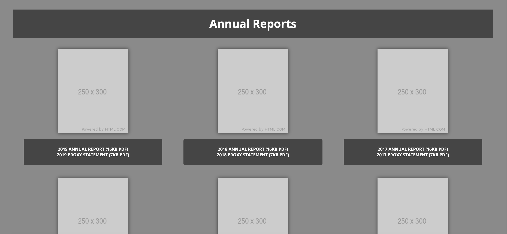
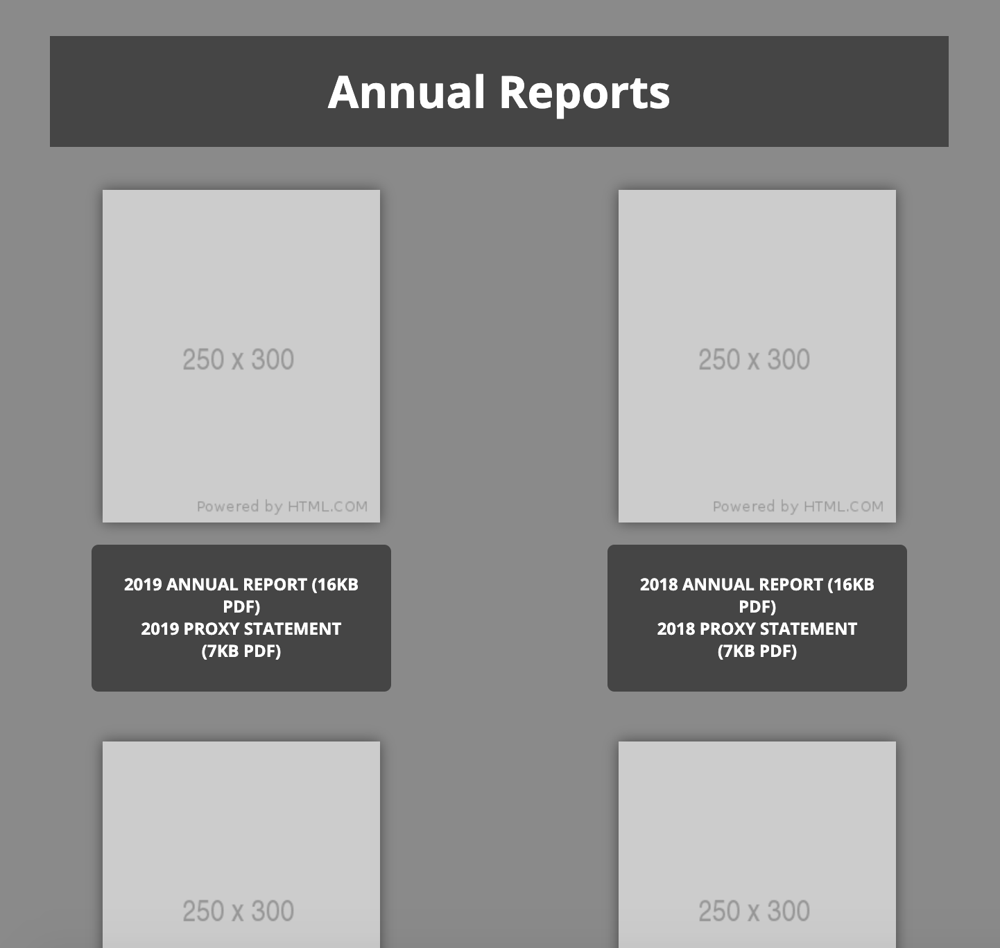

# Todo List App

A Simple Annual Reports Layout template using HTML5, CSS3, Jquery, Mustache.js (Templating) and Normalize.css. 

## Project Screen Shot(s)



## Project setup
Clone down this repository. You will need node.js and npm installed globally on your machine.

Installation:
```bash
npm install
```

To Start Server:
```bash
npm start
```